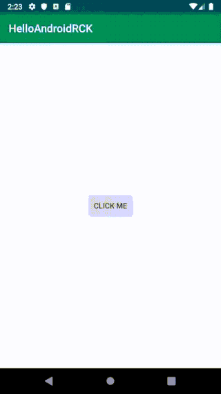

# HelloAndroidRCK

Basic example for AndroidReactComponentKit :)



## Actions

```kotlin
data class ClickButtonAction(val message: String): Action
```

## State 

```kotlin
sealed class Route {
    object None: Route()
    data class Alert(val message: String): Route()
}

data class MainState(
    val route: Route = Route.None
): State() {
    override fun copyState(): State {
        return this.copy()
    }
}
```

## MainViewModel & Define Flow

```kotlin
class MainViewModel(application: Application): RCKViewModel<MainState>(application) {

    val route = Output<Route>(Route.None)

    override fun setupStore() {

        initStore { store ->
            store.initialState(MainState())

            store.flow<ClickButtonAction>(
                { state, action ->
                    state.copy(route = Route.Alert(action.message))
                }
            )
        }

    }

    override fun on(newState: MainState) {
        route.accept(newState.route).afterReset(Route.None)
    }
}
```

## MainActivity

```kotlin
class MainActivity : AppCompatActivity() {

    private lateinit var viewModel: MainViewModel
    private val disposeBag: AutoDisposeBag by lazy {
        AutoDisposeBag(this)
    }

    override fun onCreate(savedInstanceState: Bundle?) {
        super.onCreate(savedInstanceState)

        viewModel = ViewModelProviders.of(this).get(MainViewModel::class.java)

        verticalLayout {
            lparams(matchParent, matchParent)
            gravity = Gravity.CENTER
            component(ButtonComponent(viewModel.token))
        }

        handleViewModelOutputs()
    }

    private fun handleViewModelOutputs() {
        viewModel
            .route
            .asObservable()
            .skip(1)
            .subscribe {
                handleRoute(it)
            }
            .disposedBy(disposeBag)
    }

    private fun handleRoute(route: Route) {
        when(route) {
            is Route.Alert -> {
                alert(route.message).show()
            }
            else -> Unit
        }
    }
}
```

## Button Component

```kotlin
class ButtonComponent(token: Token): ViewComponent(token) {
    private lateinit var button: Button

    override fun layout(ui: org.jetbrains.anko.AnkoContext<Context>): View = with(ui) {
        val layout = relativeLayout {
            lparams(wrapContent, wrapContent)
            button = button("Click Me")
        }

        button.setOnClickListener {
            dispatch(ClickButtonAction("Hello AndroidReactComponentKit :)"))
        }

        return layout
    }
}
```

## MIT License

The MIT License (MIT)

Copyright (c) 2016 Sungcheol Kim, [https://github.com/ReactComponentKit/HelloAndroidRCK](https://github.com/ReactComponentKit/HelloAndroidRCK)

Permission is hereby granted, free of charge, to any person obtaining a copy
of this software and associated documentation files (the "Software"), to deal
in the Software without restriction, including without limitation the rights
to use, copy, modify, merge, publish, distribute, sublicense, and/or sell
copies of the Software, and to permit persons to whom the Software is
furnished to do so, subject to the following conditions:

The above copyright notice and this permission notice shall be included in all
copies or substantial portions of the Software.

THE SOFTWARE IS PROVIDED "AS IS", WITHOUT WARRANTY OF ANY KIND, EXPRESS OR
IMPLIED, INCLUDING BUT NOT LIMITED TO THE WARRANTIES OF MERCHANTABILITY,
FITNESS FOR A PARTICULAR PURPOSE AND NONINFRINGEMENT. IN NO EVENT SHALL THE
AUTHORS OR COPYRIGHT HOLDERS BE LIABLE FOR ANY CLAIM, DAMAGES OR OTHER
LIABILITY, WHETHER IN AN ACTION OF CONTRACT, TORT OR OTHERWISE, ARISING FROM,
OUT OF OR IN CONNECTION WITH THE SOFTWARE OR THE USE OR OTHER DEALINGS IN THE
SOFTWARE.

